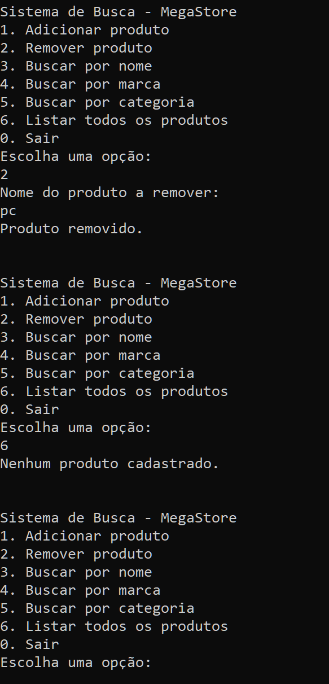
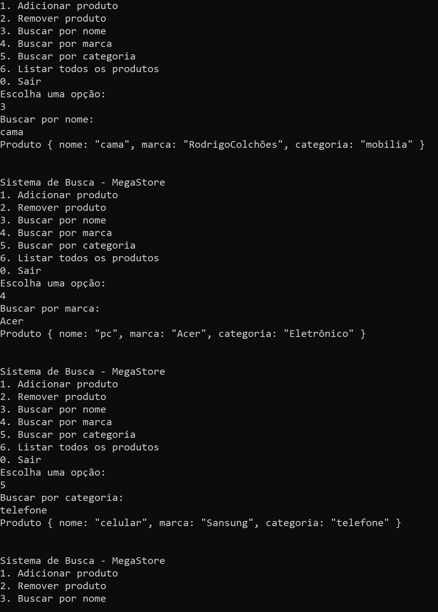
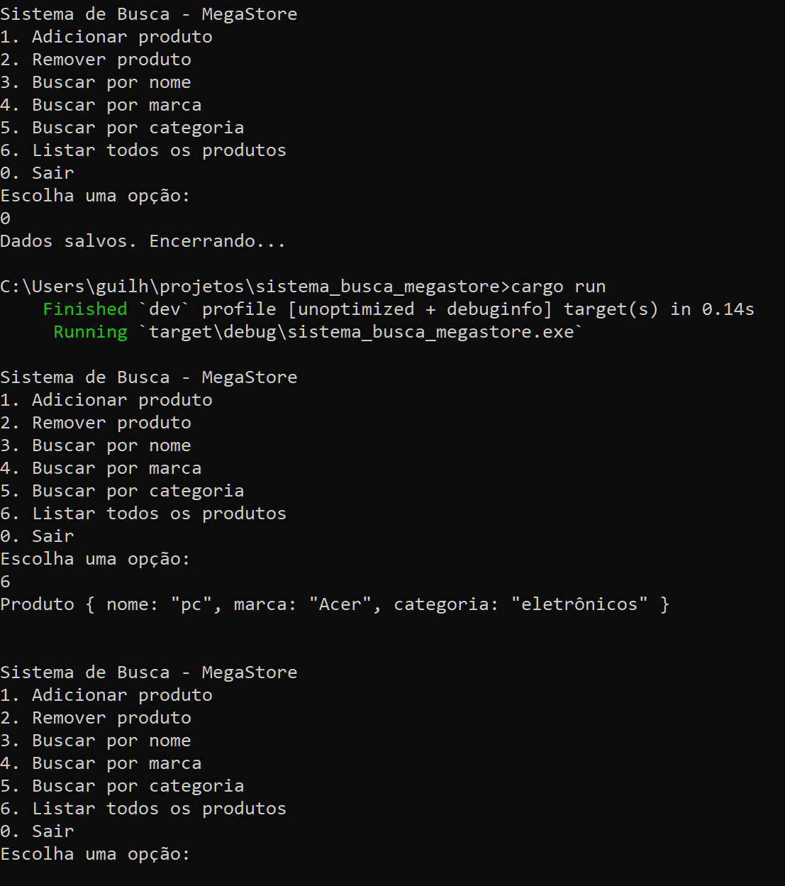

# 🔎 Sistema de Busca MegaStore

Sistema em Rust para busca eficiente de produtos da MegaStore, com foco em **alta performance**, **persistência de dados** e **interface em terminal**.

---

## 📦 Estrutura do Projeto

sistema_busca_megastore/
├── src/
│ └── main.rs
├── produtos.json # Base de dados persistente
├── Cargo.toml # Dependências do projeto
├── Cargo.lock
└── README.md # Este arquivo


---

## ⚙️ Funcionalidades

- Adição de novos produtos
- Remoção de produtos
- Busca por **nome**, **marca** ou **categoria**
- Indexação automática para buscas rápidas
- Dados persistentes no arquivo `produtos.json`

---

## 🚀 Como executar

1. Clone o repositório:

```bash
git clone https://github.com/GuILS00/Sistema-de-Buscas.casemode.git
cd Sistema-de-Buscas.casemode
cargo run

🖥️ Demonstração do Sistema
💡 As imagens abaixo demonstram cada funcionalidade.
(Se não aparecerem no GitHub, baixe o projeto e visualize localmente.)

📌 Interface Inicial
Sistema de Busca - MegaStore
1. Adicionar produto
2. Remover produto
3. Buscar por nome
4. Buscar por marca
5. Buscar por categoria
6. Listar todos os produtos
0. Sair

➕ Exemplo de Adição

Nome: Celular X
Marca: Techno
Categoria: Eletrônicos
Preço: 999.99

🔍 Busca por Categoria: Eletrônicos
Resultados:
- Celular X (Techno) - R$ 999.99

💾 Persistência após reinício
Os produtos continuam disponíveis após reiniciar o programa graças ao produtos.json.

👨‍💻 Desenvolvido por
GuILS00
🔗 GitHub

## 🖥️ Demonstração do Sistema

### 📌 Interface do Sistema
Mostra a interface do sistema ao iniciar pelo terminal.


---

### ➕ Adição de Produtos e Listagem
Demonstra a adição de produtos e a listagem completa atualizada.


---

### ❌ Remoção de Produtos
Exemplo de remoção de produto e confirmação da operação.



---

### 🔍 Busca por Nome, Marca e Categoria
Demonstra o funcionamento das buscas com resultados imediatos.



---

### 💾 Persistência de Dados
Prova que os dados inseridos são mantidos após reinicialização do sistema.


