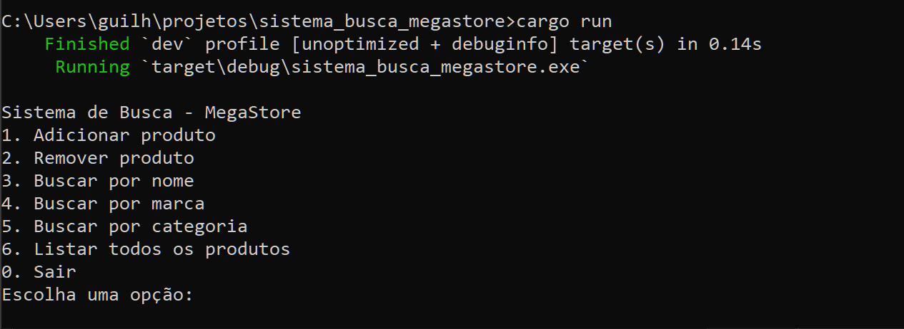
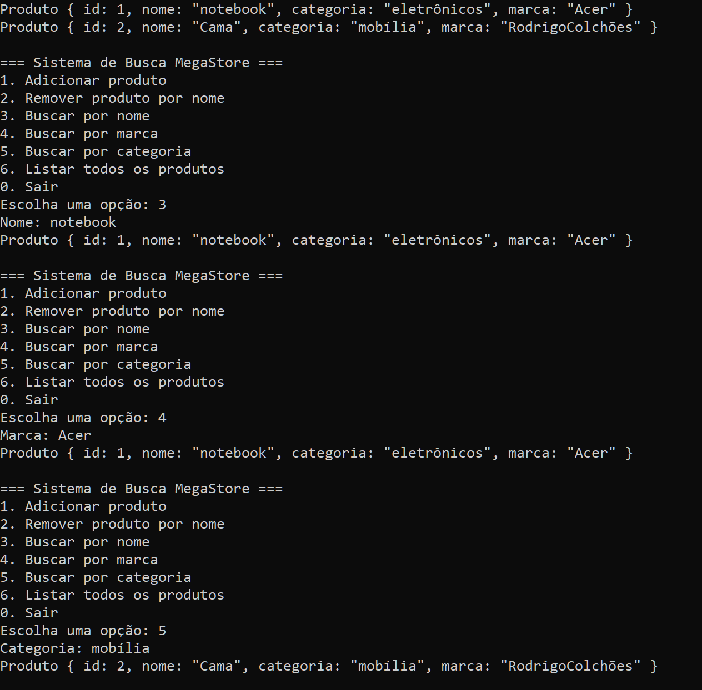
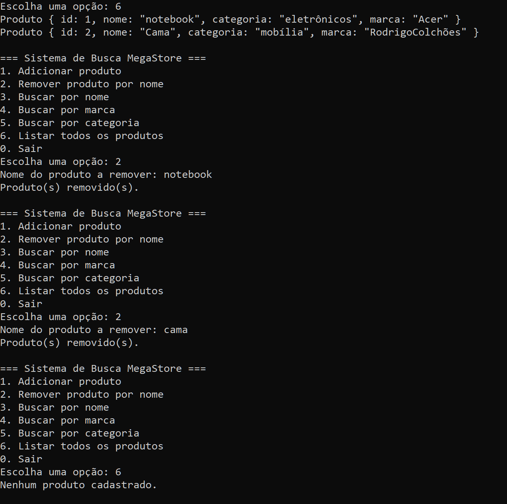
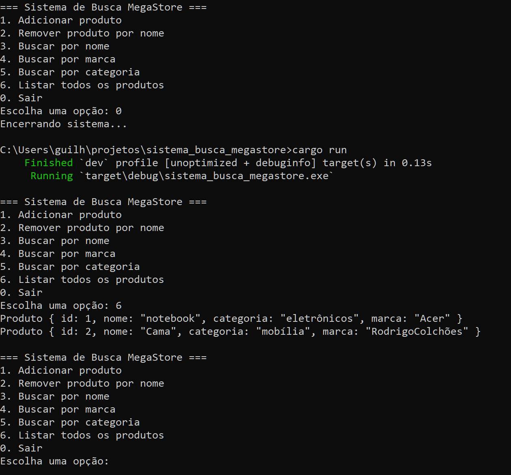

# Sistema de Busca MegaStore

Este é um sistema de busca otimizado para o catálogo de produtos da **MegaStore**, desenvolvido em Rust como parte de um projeto acadêmico. Ele foi projetado para atender aos seguintes critérios:

## ✔️ Requisitos atendidos

### ✅ Busca otimizada
- **Busca por nome, marca e categoria**, com estrutura de dados eficiente baseada em índices (HashMaps).
- Resposta imediata mesmo com grande volume de dados.

### ✅ Indexação eficiente
- Produtos são automaticamente indexados por nome, marca e categoria no momento da adição.
- Remoções também atualizam os índices dinamicamente.

### ✅ Escalabilidade
- Código modular e eficiente.
- Preparado para expansão (ex: mais campos ou filtros).
- Suporte à persistência em arquivo JSON (`produtos.json`).

### ✅ Segurança dos dados
- Armazenamento local dos produtos com leitura e escrita automática no início e fim do programa.
- Evita perda de dados com persistência em disco.

---

## 🚀 Funcionalidades

- Adicionar produto
- Remover produto por nome
- Buscar produto por:
  - Nome
  - Marca
  - Categoria
- Listar todos os produtos cadastrados
- Salvar e carregar produtos automaticamente

---

## 🧠 Tecnologias utilizadas

- Linguagem: **Rust**
- Persistência: `serde` e `serde_json`
- Estruturas: `HashMap` para indexação
- Interface: Terminal interativo (via `stdin`/`stdout`)

---

## 🗃️ Execução local

1. Clone o repositório:

```bash
git clone https://github.com/GuILS00/Sistema-de-Buscas.casemode.git

cd Sistema-de-Buscas.casemode

cargo run

sistema_busca_megastore/
├── src/
│   └── main.rs
├── produtos.json       # Base de dados persistente
├── Cargo.toml          # Dependências
├── Cargo.lock
└── README.md           # Este arquivo


Os dados são automaticamente carregados do arquivo produtos.json ao iniciar e salvos ao sair.

O sistema trata remoções e buscas com eficiência mesmo com grande volume de produtos.

GuILS00
GitHub: GuILS00


## Demonstração do Sistema (prints de tela)

### Menu interativo e execução inicial




### Adição de produtos e listagem geral


### Buscas por nome, marca e categoria



### Remoção e verificação da integridade



### Persistência: memória mantida após execução


